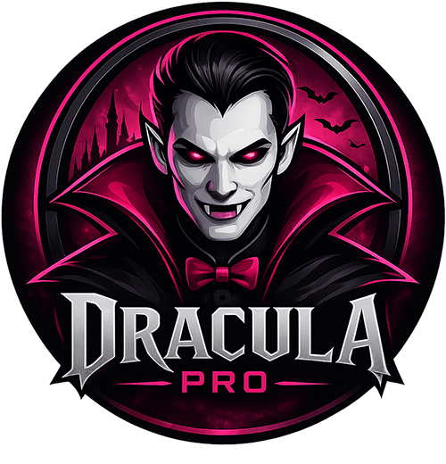

# Dracula Pro Theme Pack 🧛‍♂️

An extremely premium, mathematically-tuned color suite for VS Code inspired by Dracula Pro. This pack contains thirty high-contrast, eye-friendly variants optimized for long-term coding sessions with gorgeous depth and micro-contrasts.

## 🎨 Premium Theme Variants

1. **Dracula Pro Classic** - The core signature purple experience with a refined deep charcoal background.
2. **Dracula Pro Blade** - A cold, steel-blue variant featuring a razor-sharp cyan accent.
3. **Dracula Pro Buffy** - A deep berry, pink-centric variant that is warm and vibrant.
4. **Dracula Pro Lincoln** - A warm charcoal-olive theme highlighted by a subtle, highly visible yellow accent.
5. **Dracula Pro Morbius** - A dark crimson wine experience centered around soft red accents.
6. **Dracula Pro Van Helsing** - A cool navy/midnight theme with deep blue and cyan focus.
7. **Dracula Pro Sweet** - A sweet candy-colored pink focus layout with a deeper base background.
8. **Dracula Pro Special** - An ultra-dark theme optimized to match the official Dracula Pro branding.
9. **Dracula Pro Blood Moon** - A jet-black theme highlighted by striking crimson red accents.
10. **Dracula Pro Royal Vampire** - A deep indigo layout featuring regal violet and magenta accents.
11. **Dracula Pro Crimson Neon** - A deep space theme centered around glowing neon-red highlights.
12. **Dracula Pro Moonlight Castle** - A gothic slate layout showcasing light purple and hot-pink highlights.
13. **Dracula Pro Vampire Neon** - A pitch-black theme contrasted by super-vibrant neon pink highlights.
14. **Dracula Pro Dark Ruby** - A warm, dark chocolate layout with rich ruby-red accents.
15. **Dracula Pro Eclipse** - A space-blue theme centered around soft lilac and pink highlights.
16. **Dracula Pro Cyberpunk** - A high-tech black theme with neon yellow and cyan highlights.
17. **Dracula Pro Halloween** - A spooky black and orange theme with toxic green highlights.
18. **Dracula Pro Alucard Dark** - A clean, silver-gray Dracula variant highlighted by deep blood-red accents.
19. **Dracula Pro Frozen** - An icy blue theme contrasted by frost-white and cyan highlights.
20. **Dracula Pro Lavender** - A soft lavender and purple theme for a calm and readable interface.
21. **Dracula Pro Emerald** - A rich forest green theme with neon emerald accents.
22. **Dracula Pro Sunset** - A dusty purple-brown layout featuring warm peach and sunset gold highlights.
23. **Dracula Pro Abyss** - A deep ocean theme lit by bioluminescent cyan highlights.
24. **Dracula Pro Tokyo Night** - A Tokyo-inspired dark gray-blue layout with neon accents.
25. **Dracula Pro Nord** - A clean, arctic slate theme blending Nord slate-blue with Dracula neon accents.
26. **Dracula Pro Goth** - A pure monochromatic black layout contrasted by an active blood-red indicator.
27. **Dracula Pro Neon Green** - A toxic neon green theme over a pitch-black background.
28. **Dracula Pro Sakura** - A delicate cherry blossom layout with soft pink and rose accents.
29. **Dracula Pro Amber** - A warm, deep amber layout highlighted by glowing golden accents.
30. **Dracula Pro Synthwave** - A retro-synthwave theme highlighting bright neon-pink and indigo highlights.

## 🚀 Key Features

* **Visual Depth & Hierarchy:** Unlike flat themes, Dracula Pro utilizes carefully structured backgrounds to separate your editor, sidebar, active tabs, activity bar, and terminal.
* **Eye-Friendly Soft Neons:** Colors have been mathematically fine-tuned to reduce visual strain while maintaining high contrast (fully WCAG 2.0 AAA/AA accessible).
* **Modern Syntax Highlighting:** Handcrafted semantic scopes targeting JavaScript, TypeScript, HTML, CSS, Go, Rust, Python, and more.
* **Distinct Interactive States:** Beautiful hover effects, list highlights, scrollbars, and customized cursor glow.

---
*Crafted with 💜 for a premium coding experience.*
